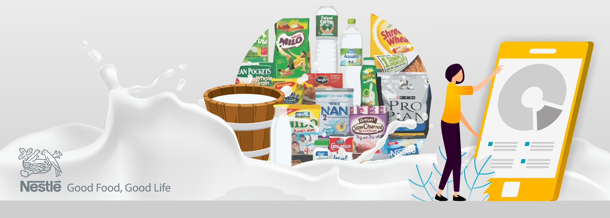
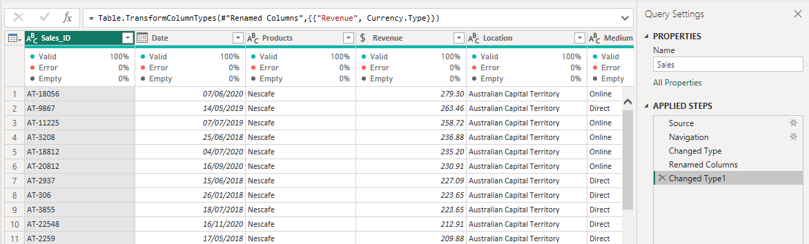
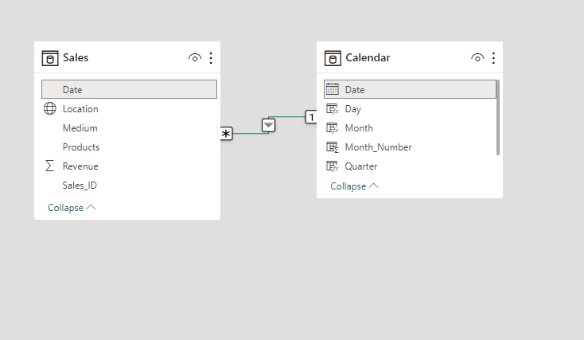
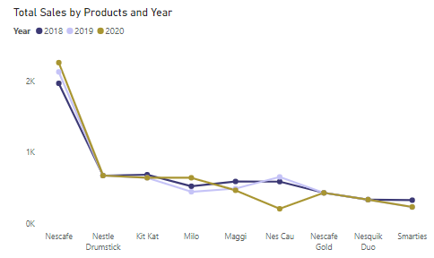
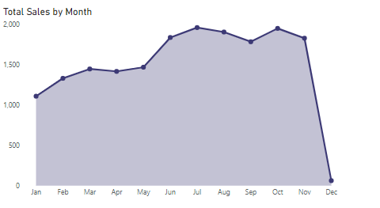
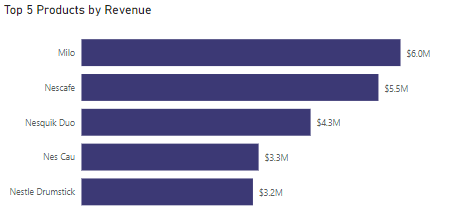
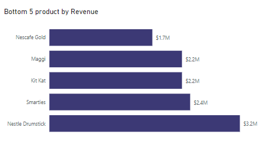
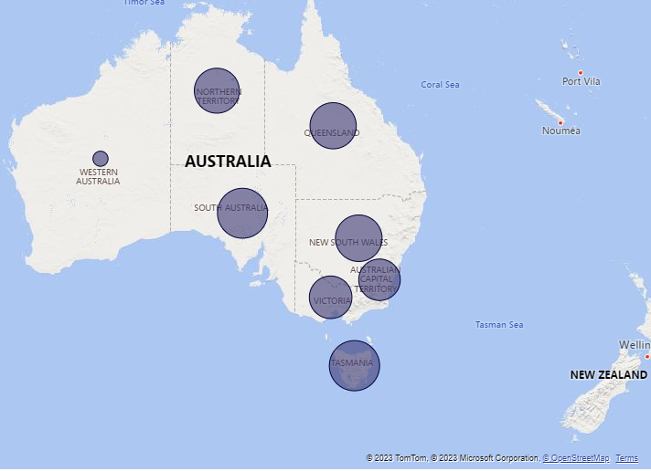
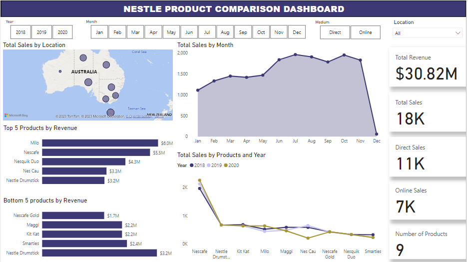

# Nestle Products Analysis - Sales Analysis (2018 - 2020)

This is a sales analysis of Nestle products sold in Australia.

## Introduction
The dataset is from [10Alytics](https://www.linkedin.com/company/10alytics/) during my growth internship program.  This dataset tested my skills in data analysis and data visualization.

### Power BI Concepts Applied
- DAX Concepts: Calculated column, Calendar Table, .
- Data Modelling: Star Schema

## Problem Statement
The company wants to expand its business by adding new product lines. However, the Head of Growth and Strategy suggested that it was important to know the performance of the current products.
- What is the trend of total sales per product in the last 3 years?
- What is the monthly sales trend?
- Compare the different products based on the maximum and min revenue generated?
- Which location had the highest and lowest sales?
- Generate insights from the sales medium to help the Head of Growth take a decision?

## Data Sourcing
The data contains only a tables; Sales table of nestle product sales in different states/cities of Australia. The sales table has 18,115 Rows and 6 columns.
A Calendar table (2018-2020) was created with Date, year, month, quarter and day columns.

## Data Transformation/Cleaning

## Data Modelling
Sales table connected to the calendar table resulting in star schema model. The Sales tabele is the fact table while the calendar table is the dimension table.

## Data Analysis and Visuals

### Total sales per Product in the last 3 years.
**The product sold the highest in the last 3 years is Nescafe**

### Monthly Sales Trend
**Most products are sold in July(1,962) followed by October(1,952) and  Sales are mostly low in December**

### Top 5 Products with highest Revenue generated in the last 3yrs.
**Milo generted the highest Revenue with over $6million followed by Nescafe with over $5.5million**

### Bottom 5 Products with least Revenue generated in the last 3yrs.
**Nescafe Gold generated the least Revenue with $1.7million**

### Location with the highest and lowest Sales
**Tasmania (3,187) had the highest sales followed closely by South Australia (3,143)**

**Western Australia had the lowest sales**

### The Dashboard

Interact with the [Dashboard](https://app.powerbi.com/view?r=eyJrIjoiYjQzMjliNzQtYmY4MC00OTEzLTgxY2YtNzI3YTU0NTE5MjdlIiwidCI6ImM3ZTFiYjRlLTU1OTYtNDQyZS1iYThiLWM1MDUzOWZlZjUyZCJ9)

## Conclusion/Recommendation
- Though Nescafe made more sales but milo generated more revenue. 
- milo is never sold online in as much it generated the highest revenue, The head of growth should consider adding milo to the list online.
-  Sales and revenue are higher in the Direct medium than Online.
- Nes Cau, Nesquik Duo, and Nestle Drumstick: These products did not made sales via online throughout 2020 but are sold directly. Further analysis needs to be carried out so we can find out why this happen.
- Generally more revenue is generated via the direct medium(23.80Million) for the 3yrs. Nescafe generated more revenue online of over $3.1m followed by Kit Kat with over $1.9million.
- In order to increase revenue and sales, the head of growth should take advantage of the online medium, doing promotions for products that have least sales via the online medium 

